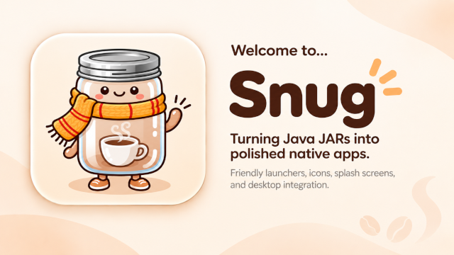
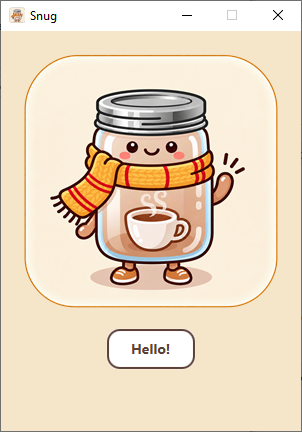

<div align="center">



# snug

> A small, modern, Rust-based launcher-wrapper for Java fat JARs. Turns
> `MyApp-fat.jar` into `MyApp.exe` — without bundling a JVM.

</div>

---

> **THIS IS NOWHERE NEAR READY - BUT IT IS CLOSE, PLEASE COME BACK LATER**
> 
---

Snug generates a single native Windows `.exe` that:

- contains the complete fat JAR
- embeds the application icon and optional splash image
- carries Windows application/version metadata (and an optional
  application manifest for DPI awareness, UAC, etc.)
- locates an installed Java 25+ at runtime (env, PATH, registry,
  common install paths)
- can (with `--download-jdk`) auto-download and verify Eclipse Temurin
  from Adoptium when no compatible JVM is present
- loads `jvm.dll` directly via JNI — no `javaw.exe` indirection — so the
  application shows up as `MyApp.exe` in Task Manager

It is conceptually similar to [exe4j] or [Launch4j], but small, modern,
Rust-based, and open source.

[exe4j]: https://www.ej-technologies.com/products/exe4j/overview.html
[Launch4j]: https://launch4j.sourceforge.net/

## Quick Demo

For a quick demo of a JavaFx java demo (with a splashscreen) have a look at
and run the `./assets/snug-javafx-demo.exe`.

<div align="center"></div>

## Status

**Pre-alpha.** Slices 1, 3, and 5 are done; the CLI builds a real
Windows `.exe` end-to-end with in-process resource stamping, and the
launcher runtime in the stub can locate its payload, extract the JAR to
a per-user cache, discover a compatible JVM + `jvm.dll`, and (with
`--download-jdk`) download Eclipse Temurin from Adoptium, verify its
SHA-256 on disk, extract it, and hand the JVM home back to the
discovery path. Slice 2 is partial — the actual `JNI_CreateJavaVM`
invocation step is currently stubbed and returns `JniStub`; it needs
Windows-machine validation with the `jni` 0.22 invocation API before we
wire it up.

| Slice | Status |
|-------|--------|
| CLI surface + embedded-payload format | done |
| Windows launcher runtime (JVM discovery + JNI + splash) | partial — runtime logic + cross-compiled stub in place; JNI launch stubbed, needs Windows validation |
| snug-cli builder: stub + payload concatenation, in-process `editpe` resource stamping | **done** |
| Resource stamping — `VS_VERSIONINFO` (`ProductName`, `CompanyName`, `FileDescription`, `LegalCopyright`, `FixedFileInfo` file/product version, `VFT_APP`) + optional `--icon` + optional `--manifest` | done |
| Native splash renderer (PNG via GDI+/WIC) | planned |
| Per-user cache layout (`%LOCALAPPDATA%\snug\<company>\<app>\<jar-sha256>\`) | done |
| Per-launch log file (`...\<jar-sha256>\snug.log`, truncated on each launch) | done |
| Old-version cache cleanup | planned |
| Editable dialog text (`crates/snug-launcher/dialogs.toml`) | done |
| GitHub Actions CI (windows-latest release) | planned |

## Quick start

```text
# Wrap a fat JAR into a Windows .exe:
snug app.jar -o App.exe --name "My App" --company "SynapticLoop" \
    --version 1.0.0 --main-class com.example.Main --min-java 25

# Stamp a PNG icon and an arbitrary Windows application manifest
# (icon and manifest are optional; version info is always stamped):
snug app.jar -o App.exe --icon assets/icon.png --manifest assets/app.manifest.xml

# Forward extra JVM options (repeatable):
snug app.jar -o App.exe --jvm-arg=-Xms256m --jvm-arg=-Xmx2g \
                       --jvm-arg=-Dfile.encoding=UTF-8

# Show a PNG splash before the JVM starts (dismissed on ready or after --splash-ms):
snug app.jar -o App.exe --splash assets/splash.png --splash-ms 2500

# Pass the JAR via `--input` (also accepts a directory of JARs for a multi-JAR
# classpath; Main-Class is read from the first JAR's manifest):
snug --input path/to/app.jar  -o App.exe
snug --input path/to/lib-dir/ -o App.exe --main-class com.example.Main

# Auto-download Eclipse Temurin if the host has no compatible JDK.
# `--download-jdk` (no value) = `auto`: only on discovery miss.
# `--download-jdk=force`       = always show the dialog, bypass discovery.
# `--download-jdk=off`         = never offer a download (the default).
snug app.jar -o App.exe --download-jdk           # auto
snug app.jar -o App.exe --download-jdk=force     # always prompt

# Inspect what would be built without writing anything:
snug app.jar -o App.exe --dry-run

# Pipe the encoded payload to stdout instead of building an EXE
# (useful for piping into other tools or for inspecting the format):
snug app.jar --emit-payload

# Use a `snug.options` file for default settings (CLI flags always override).
# Each line is parsed as if it were on the command line; `#` is a comment.
# `--input` (file or directory) and every other flag can live here too,
# so the JAR location doesn't have to be on the command line:
#   # snug.options (in cwd)
#   --input path/to/app.jar         # or path/to/lib-dir/
#   --name "My App"
#   --company "SynapticLoop"
#   --min-java 25
#   --download-jdk=force
snug -o App.exe --name "Different Name"   # --name overrides the file

# Snug's own version (distinct from --version, which sets the app's version):
snug --snug-version
```

The produced `.exe` is a 64-bit Windows GUI binary that:
- contains the full fat JAR + icon + splash (when supplied) embedded at
  the tail behind an 8-byte `SNUGEMBD` magic trailer,
- displays as a Windows GUI executable (no console window),
- on launch scans itself for the `SNUGEMBD` trailer, decodes the
  postcard payload, extracts the JAR to
  `%LOCALAPPDATA%\snug\<company>\<name>\<jar-sha256>\app.jar`, locates
  a Java 25+ install + `jvm.dll`, and invokes the Java `main` class.

## Demo

A JavaFX demo JAR ships with the repo at
`assets/snug-javafx-demo.jar`. End-to-end build (from the repo root):

```powershell
# Option A: the included build script (builds launcher + CLI + packages demo):
.\scripts\build-release.cmd

# Option B: the equivalent by hand:
cargo build --release -p snug-launcher
copy /Y target\release\snug-launcher.exe bin\launcher-stub.exe
cargo build --release -p snug-cli
target\release\snug.exe assets\snug-javafx-demo.jar ^
    -o snug-javafx-demo.exe ^
    --name "Snug JavaFX Demo" --company "SynapticLoop" --version 0.1.0 ^
    --description "Snug JavaFX demo launcher" --copyright "© SynapticLoop" ^
    --icon assets\snug-icon.png
```

The JAR's `Main-Class` (`synapticloop.snugjavafxdemo.HelloApplication`)
is read from its manifest, so no `--main-class` override is needed.

`scripts\build-release.cmd` accepts `--SkipLauncherRebuild` (skip steps
1+2, useful when iterating on CLI-only code) and `--SkipPackage`
(skip the final `snug.exe` packaging step).

## Layout

```text
snug/
├── Cargo.toml                  # workspace root
├── AGENTS.md                   # project context for AI agents
├── HANDOFF.md                  # session-end notes for the next agent
├── README.md                   # this file
├── assets/
│   ├── snug-icon.png           # 1254×1254, used by README + --icon examples
│   └── snug-javafx-demo.jar    # JavaFX demo fat JAR (Main-Class read from manifest)
├── bin/
│   └── launcher-stub.exe       # precompiled cross-platform stub (PE32+ GUI x86-64, ~454 KB)
├── scripts/
│   └── build-release.cmd       # Windows batch pipeline: launcher + CLI + demo EXE
└── crates/
    ├── snug-format/            # embedded-payload types + postcard codec (the wire contract)
    ├── snug-launcher/
    │   ├── dialogs.toml         # every user-facing string (titles, prompts, button labels)
    │   └── src/dialogs.rs      # include_str!s the TOML at compile time, fills `{name}` placeholders
    └── snug-cli/               # CLI + stub-append builder + snug.options + editpe stamping
```

`snug-format` is the **contract** between the builder (CLI side) and the
launcher (runtime side). The wire layout is:

```text
+--------+----------------+--------------+--------------+----------------------+
| magic  | format_version | payload_len  | payload_crc32| payload (postcard)   |
| 8 B    | u16 LE         | u32 LE       | u32 LE       | payload_len bytes    |
+--------+----------------+--------------+--------------+----------------------+
```

The 8-byte magic is `SNUGEMBD`. `format_version` is currently `5`
(bumped from 1 → 4 in 2026-09 to capture the JDK download flow
schema; the decoder rejects payloads with a higher version than it
understands, so old stubs need rebuilding when the version moves).
`payload_crc32` is CRC32/IEEE of the postcard bytes; the launcher
validates before decoding. Payload is a postcard-encoded
`SnugPayload { config, jar, icon }`.

The stub is currently appended (v1, `bin/launcher-stub.exe`); the
launcher locates the trailer by scanning itself for the magic. A v2
that stores the payload as an `RCDATA` resource is a planned
hardening slice.

## Building

Prerequisites: a Rust 1.85+ toolchain. To (re)build the Windows stub
from macOS or Linux you also need `zig` 0.14+ and `cargo-zigbuild`. On
Windows the native `x86_64-pc-windows-msvc` target works without
zig.

```bash
# one-time setup on a fresh Mac/Linux dev box
brew install zig                                  # or download from ziglang.org
rustup target add x86_64-pc-windows-gnu
cargo install cargo-zigbuild --locked

# full workspace tests
cargo test --workspace

# build the snug CLI for the host platform
cargo build --release -p snug-cli

# regenerate the stub after changing snug-launcher code
# (Mac/Linux via zigbuild):
cargo zigbuild --target x86_64-pc-windows-gnu --release -p snug-launcher
cp target/x86_64-pc-windows-gnu/release/snug-launcher.exe bin/launcher-stub.exe
# (Windows native — no zig needed):
cargo build --release -p snug-launcher
Copy-Item target\release\snug-launcher.exe bin\launcher-stub.exe -Force
```

Notable test binaries:

- `crates/snug-format/tests/roundtrip.rs` — payload encode/decode
- `crates/snug-launcher/tests/stub_payload_roundtrip.rs` — proves the
  stub's locator still finds the real trailer among the false-positive
  `SNUGEMBD` substrings inside the stub binary
- `crates/snug-launcher/tests/...` — `find_java_home` roundtrips
  (Adoptium's nested `jdk-X.Y.Z/` layout), `dialogs` TOML parsing,
  live progress text formatting
- `crates/snug-cli/tests/end_to_end.rs` — full CLI invocation,
  stub-append, PE resource stamp
- `crates/snug-cli/tests/editpe_roundtrip.rs` — `editpe`-based icon /
  version / manifest stamping roundtrip
- `crates/snug-cli/tests/options_file.rs`, `tests/no_args.rs` —
  `snug.options` config-file and no-args help behaviour

## CLI surface (canonical)

```text
snug [<jar>] [-o EXE] [--input JAR|DIR] [--name ...] [--company ...]
           [--version ...] [--description ...] [--copyright ...]
           [--min-java N] [--main-class CLASS]
           [--icon PNG/ICO] [--manifest XML] [--splash PNG] [--splash-ms MS]
           [--jvm-arg ARG]...
           [--download-jdk[=<MODE>]]      # off | auto | force
           [--emit-payload] [--dry-run] [--snug-version]
           [--options PATH]
```

`--download-jdk` accepts an optional value:

- omitted — `off` (no download flow; default).
- `--download-jdk` (no value) — `auto`: pop the dialog only when JVM
  discovery fails. Equivalent to the legacy boolean flag.
- `--download-jdk=auto` — same as above, explicit.
- `--download-jdk=force` — always show the dialog, bypassing JVM
  discovery. Useful when the end user wants to install Temurin
  regardless of what's on `JAVA_HOME` / `PATH`.

Snug's own version (from `Cargo.toml`) is `--snug-version` (clap's
auto `--version` is disabled so the brief's `--version <APP-VERSION>`
doesn't collide with it).

Resource stamping is unconditional and in-process — there is no
`--rcedit` / `--no-rcedit` flag any more; the prior subprocess
integration was replaced by the pure-Rust
[`editpe`](https://github.com/Systemcluster/editpe) crate, which works
identically on macOS, Linux, and Windows.

## JDK auto-download

With `--download-jdk`, the launcher can fetch a matching Temurin JDK
from `api.adoptium.net` when no compatible JVM is on the host.

The flow:

1. Cache check — scan `%LOCALAPPDATA%\snug\jdk\<version>\` for a
   previously-extracted Temurin whose `java -version` reports a
   sufficient major. Reused silently.
2. Metadata fetch — `GET https://api.adoptium.net/v3/assets/feature_releases/<major>/ga?architecture=x64&image_type=jdk&os=windows&vendor=eclipse`.
   Returns the latest GA release with `binaries[].package.{link,
   checksum, size}` and `version_data.semver`.
3. Dialog — first-run users see a `TaskDialog` with **Download
   Temurin X.Y.Z+1 now / Open the download page in my browser /
   Cancel** (button text is editable — see below).
4. Download + verify — fetch the zip to a temp file, stream-hash it
   with SHA-256, fail the install if the hash doesn't match the
   declared checksum.
5. Extract — unpack into `%LOCALAPPDATA%\snug\jdk\<version>\jdk-X.Y.Z+1\`
   (Adoptium's zips carry a leading directory; `find_java_home` walks
   up to 3 levels to locate `bin\java.exe`).
6. Re-discover — set `JAVA_HOME` to the resolved home and re-run the
   discovery chain. The launcher continues as if Temurin had been on
   `PATH` all along.

A live progress dialog drives the download: title `Downloading Eclipse
Temurin…`, a determinate progress bar (`TDF_SHOW_PROGRESS_BAR` +
`TDN_TIMER` callback drives `TDM_SET_PROGRESS_BAR_POS`), and a status
line rewritten every ~200 ms via `TDM_SET_ELEMENT_TEXT(TDE_CONTENT, …)`
with `Downloaded X MB of Y MB (Z%)` / `Verifying SHA-256… (Z%)` /
`Extracting… (Z%)`.

If `api.adoptium.net` itself is unreachable, the user sees a separate
"Could not reach Adoptium — Snug" dialog with **Open the download page
in my browser / Cancel** so they can still install Temurin manually
from the fallback URL.

## Per-launch log file

Every launch writes a structured trace to
`%LOCALAPPDATA%\snug\<company>\<app>\<jar-sha256>\snug.log`, alongside
the cached `app.jar`. The file is truncated on each launch so each
session produces a self-contained record.

```text
[1758370000] snug-launcher starting — log file: ...
[1758370000] app: SynapticLoop / Snug JavaFX Demo
[1758370000] cache_root: C:\Users\Admin\AppData\Local\snug\SynapticLoop\Snug JavaFX Demo
[1758370000] primary JAR sha256: abc…64hex…
[1758370000] cached jars: 1
[1758370000] min-java: 25
[1758370000] download-jdk mode: Force
[1758370000] main class: synapticloop.snugjavafxdemo.Launcher
[1758370000] JVM discovery: skipped (download-jdk=force)
[1758370000] JDK install flow starting; root: C:\Users\Admin\AppData\Local\snug\jdk
[1758370000] JDK cache miss under ...; need min_java=25
[1758370000] Adoptium metadata: version=25.0.4+101.0.LTS, size=141167264 bytes
[1758370000] Adoptium package link: https://github.com/adoptium/...
[1758370000] Adoptium SHA-256: 00c847d8…
[1758370000] phase 0 (download): url=..., expected_size=141167264 bytes
[1758370000] phase 0 complete: 141167264 bytes written to ...
[1758370000] phase 1 (verify SHA-256) starting
[1758370000] phase 1: computed SHA-256 = 00c847d8…
[1758370000] phase 1: SHA-256 verified
[1758370000] phase 2 (extract): zip=... → dest=...
[1758370000] phase 2: extracted JDK home = ...\jdk-25.0.4.1+1
[1758370000] JDK install flow succeeded: ...
[1758370000] using JAVA_HOME: ...
[1758370000] loading jvm.dll from: ...\jdk-25.0.4.1+1\bin\server\jvm.dll
```

Lines are mirrored to stderr so debug builds (console subsystem) see
the trace live; on release builds (GUI subsystem) stderr is detached
and the file is the only visible record.

## Editable dialog text

Every user-facing string the launcher shows — download prompt title
and body, button labels, progress bar text, success / failure dialogs
— lives in `crates/snug-launcher/dialogs.toml`. Edit the file, rerun
`scripts\build-release.cmd`, and the rebuilt EXE picks up the change
with no Rust edits needed.

```toml
[jdk_install.prompt]
title = "Java Runtime Required — Snug"
main  = "Eclipse Temurin JDK was not found on this machine"
content = """\
This application needs a Java {version} or higher. Snug can download the \
official Eclipse Temurin {version} (~{size_mb} MB) and install it to a per-user \
location, or open the download page in your browser.\n\n\
Download will be verified against the official SHA-256."""

button_download     = "Download Temurin {version} now"
button_open_browser = "Open the download page in my browser"
button_cancel       = "Cancel"

[jdk_install.metadata_failed]
title   = "Could not reach Adoptium — Snug"
content = """\
Either this host has no internet access, a firewall or proxy is blocking the \
request, or the Adoptium API is temporarily unavailable.\n\n\
…"""
```

Templates use `{name}` placeholders (no `{name:.spec}` formatters —
apply formatting to values in Rust before substitution). Unknown
placeholders are left intact so a typo never silently swallows text.
If the TOML is malformed, the launcher panics at first use with the
exact line/column from `toml::de::Error`.

## Licence

Dual-licensed under MIT OR Apache-2.0, at your option.

<div align="center"></div>