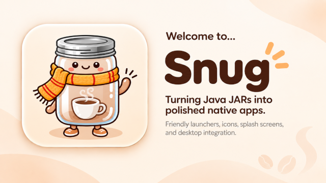
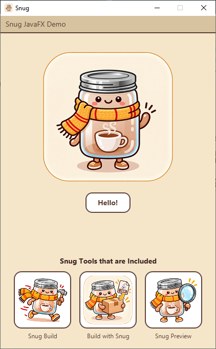

<div align="center">



# snug
> Snug deliberately does less. It creates a polished, self-managing launch experience for your Java application, then gets out of the way.

> A small, modern, Rust-based launcher-wrapper That turns Java jars into a clickable Windows application

</div>

---

> **THIS IS NOWHERE NEAR READY - BUT IT IS CLOSE, PLEASE COME BACK LATER**

---

# Quick-Start

1. Download `snug.exe` and `snug-javafx-demo-windows.jar`
2. Run the following command

```
snug.exe --company "My Company" --name "My App" snug-javafx-demo.exe
```

Then either run

```
snug-javafx-demo.exe 
```

Or double-click on the icon

## Quick Demo

For a quick demo of a JavaFx java demo (with a splashscreen) have a look at
and run the `./assets/snug-javafx-demo.exe`.

<div align="center"></div>

# Why use Snug?

- **Make Java applications easy to run.** Turn your application into a 
  familiar Windows executable that users can just double-click on.
- **Remove Java setup from the user.** Snug takes care of finding or downloading 
  the required Java runtime.
- **Create a more polished application.** Add your own start up splash screen,
  icon, application name, version information and other metadata.
- **Make deployment simpler.** Give colleagues a straightforward executable 
  they can run without needing to understand what the underlying language is.
- **Keep applications local.** Useful for internal business tools that should 
  run on a user’s own computer rather than being hosted as a web application.
- **Reuse runtimes efficiently.** Applications can make use of downloaded 
  runtime components instead of bundling a complete Java runtime into every application.
- **Control how your application launches.** Configure Java requirements, 
  startup behaviour, arguments and other deployment details to suit your application.
- **Bridge the gap between building and distributing.** Snug handles the 
  awkward packaging and launching work that sits between a working Java application and something ready for everyday office use.

# What Snug is Not

- **Snug is not an application store or publishing platform.** It does not 
  host your application, provide a public download page, or publish releases 
  for you.  It builds locally, you can run it locally yourself, or give people a copy to run themselves.
- **Snug does not have a built-in application update mechanism for your 
  application.** If you distribute a new version, you decide how that version is delivered to users. (That is not to say that you couldn't check for updates in your main application and point people at the new download location)
- **Snug does not require your application to be published publicly.** It is 
  well suited to internal applications that are simply copied to colleagues, placed on a shared drive, or distributed through whatever process your business already uses.  This bypasses code-signing the application, which can be expensive for the use cases — see [Distributing what you build](#distributing-what-you-build) for what each platform asks of you instead.
- **Snug is not an installer framework.** Its primary job is to create a 
  native executable and manage the Java launch experience, rather than build a complete installation and uninstallation system. (This means that you will NOT get a Start menu icon or a desktop shortcut - but you can still run it from your desktop)
- **Snug does not provide cloud-based deployment infrastructure.** There is 
  no requirement for npm, GitHub Releases, a hosted service, or an online account simply to distribute an application.
- **Snug does not dictate how you distribute your software.** Once the 
  executable has been created, you remain in control of where it goes and who receives it.

## Distributing what you build

Snug does not sign your application, and neither platform makes signing
free. What both operating systems *do* is apply a trust check to a
binary they have not seen before — and both have a way past it that costs
one click or one command. For software handed to colleagues, this is a
five-minute job, not a blocker.

The honest summary of where that leaves macOS: **a snug-built `.app` is
really a personal and small-team tool.** Run it yourself, hand it to
colleagues, drop it on the shared drive — all of that works well, and the
artefact is small enough to pass around. The moment you want to give it to
the public, macOS starts asking questions snug cannot answer, because those
answers belong to Apple. Windows never asks them, so the very same binary
that needs a caveat on a Mac needs none there. If you are shipping to
strangers, read the next subsection before committing to the tool.

| | Windows | macOS |
|---|---|---|
| what triggers it | an unsigned `.exe` downloaded in a browser | a `com.apple.quarantine` attribute on a downloaded `.app` |
| what the user sees | "Windows protected your PC" → **More info** → **Run anyway** | "…cannot be opened because the developer cannot be verified" → Control-click → **Open** |
| from a terminal | `Unblock-File App.exe` before the first run | `xattr -dr com.apple.quarantine MyApp.app` |
| is it permanent | yes, unblocking clears it for that copy | yes, removing the attribute is permanent for that copy |

Two macOS details are worth knowing, because the second one is genuinely
confusing.

**A browser is the only thing that causes this.** Quarantine is set by
browsers and by nothing else. A `.app` that arrives over a file share, an
internal share, AirDrop, or a deployment script has no quarantine
attribute and launches normally — which is why "just put it on the shared
drive" is the smoothest distribution path on macOS, and worth preferring
over a download link where you get the choice.

**Launched from a terminal, the failure is silent.** Gatekeeper kills a
quarantined binary that has not been cleared, and from Terminal that
surfaces as `Killed: 9` and exit code 137 — no dialog, nothing on
stderr. Anyone who tries `./MyApp.app/Contents/MacOS/MyApp` before
clearing the attribute will reasonably conclude the build is broken.
Clear the attribute first.

Snug already applies an **ad-hoc signature** (`codesign --sign -`) to
every bundle it produces, and that is not polish. Apple Silicon will not
execute an unsigned binary at all, so an ad-hoc signature is the floor
for *running* rather than a distribution credential. It carries no
developer identity, which is precisely why Gatekeeper still applies to
it.

### If you are distributing to the public

This is where snug on macOS stops being the right tool, and it is worth
being straight about the two reasons.

**A snug-built `.app` is in the same trust class as an Electron app, not
a native one.** Notarizing it requires the hardened runtime, which turns
on *library validation* — and library validation only permits loading
code signed by Apple or by the same Team ID. Snug's launcher loads
`libjvm.dylib` from whatever JDK the user already has, which is signed by
Oracle, Eclipse or Adoptium and never by you. So a notarized snug app
must ship with the `disable-library-validation` entitlement, which is
exactly the protection Apple's own guidance tells you to keep. It
notarizes and it runs; it is just not a native-grade trust profile, and
users will assume otherwise. That is a consequence of snug *not*
bundling a JVM, not a bug that more engineering would fix.

**`jpackage` is the better answer for public distribution, and snug is
the better answer for almost everything else.** `jpackage` bundles a
`jlink`'d runtime *inside* the app image and signs every component with
the same identity, so it notarizes cleanly with no exceptions needed.
What it cannot do is build cross-platform — Apple's documentation is
explicit that packages must be built on the target platform, and macOS
signing additionally needs the Xcode command line tools. So if you develop
on Windows and have colleagues on Macs, `jpackage` cannot produce
anything for them and snug can: from the same fat JAR, on the same
machine, with the same command.


Snug generates a single native Windows `.exe` that:

- contains the complete fat JAR
- embeds the application icon and optional splash image
- carries Windows application/version metadata (and an optional
  application manifest for DPI awareness, UAC, etc.)
- locates an installed Java 25+ at runtime (env, PATH, registry,
  common install paths)
- can (with `--download-jdk`) auto-download and verify Eclipse Temurin
  from Adoptium when no compatible JVM is present
- loads `jvm.dll` directly via JNI — no `javaw.exe` indirection — so the
  application shows up as `MyApp.exe` in Task Manager

It is conceptually similar to [exe4j] or [Launch4j], but small, modern,
Rust-based, and open source.

[exe4j]: https://www.ej-technologies.com/products/exe4j/overview.html
[Launch4j]: https://launch4j.sourceforge.net/


## Status

**Pre-alpha, and both launchers work on real machines.** The CLI builds a
real Windows `.exe` end-to-end with in-process resource stamping, and a
real macOS `.app` end-to-end with an ad-hoc signature. Both launcher
runtimes locate their payload, extract the JAR to a per-user cache,
discover a compatible JVM, load `jvm.dll` / `libjvm.dylib`, and invoke
the Java `main` class through the `jni` 0.22 invocation API. With
`--download-jdk` they will also fetch Eclipse Temurin from Adoptium,
verify its SHA-256 on disk, extract it, and hand the JVM home back to
discovery. The Windows path was validated on a Windows machine; the macOS
path on a Mac, including the JavaFX system menu bar.

| Slice | Status |
|-------|--------|
| CLI surface + embedded-payload format | done |
| Windows launcher runtime (JVM discovery + JNI) | **done, verified on a Windows machine** |
| macOS launcher runtime (`libjvm.dylib` + JNI, cache, JDK discovery) | **done, verified on a Mac** |
| snug-cli builder: stub + payload concatenation, in-process `editpe` resource stamping | **done** |
| macOS `.app` emitter (`Contents/{Info.plist,MacOS,Resources}`, ad-hoc signed) | **done** |
| Windows resource stamping — `VS_VERSIONINFO` (`ProductName`, `CompanyName`, `FileDescription`, `LegalCopyright`, `FixedFileInfo` file/product version, `VFT_APP`) + optional `--icon` + optional `--manifest` | done |
| macOS app menu / `CFBundleName` from `--name` | done |
| Per-user cache — `%LOCALAPPDATA%\snug` (Windows), `~/Library/Caches/snug` (macOS) | done |
| Per-launch log file (`<cache>\snug.log`, truncated on each launch) | done |
| Old-version cache cleanup | done — entries expire on use, swept at most once per 6h |
| Editable dialog text (`snug-format/assets/snug-localisations.en.txt`) | done, and shared by the Windows and macOS dialogs |
| macOS JDK download dialogs (consent, progress, retry, failure) | done |
| Native splash renderer (PNG via GDI+/WIC) | Windows only; not on macOS |
| GitHub Actions CI (windows-latest release) | planned |

The macOS launcher builds and runs natively too — macOS is where snug is
developed — and its dialogs carry the *same* localised strings as the
Windows ones, so a `--localization` bundle translates both. See
`AGENTS.md` for the platform notes, including the one genuinely
surprising constraint: the launcher must never create an `NSApplication`
before JavaFX does, or JavaFX concludes it is embedded in another toolkit
and the launched app loses its menu bar.

## Quick start

```text
# Wrap a fat JAR into a Windows .exe:
snug app.jar -o App.exe --name "My App" --company "SynapticLoop" \
    --version 1.0.0 --main-class com.example.Main --min-java 25

# Stamp a PNG icon and an arbitrary Windows application manifest
# (icon and manifest are optional; version info is always stamped):
snug app.jar -o App.exe --icon assets/icon.png --manifest assets/app.manifest.xml

# Forward extra JVM options (repeatable):
snug app.jar -o App.exe --jvm-arg=-Xms256m --jvm-arg=-Xmx2g \
                       --jvm-arg=-Dfile.encoding=UTF-8

# Show a PNG splash before the JVM starts (dismissed on ready or after --splash-ms):
snug app.jar -o App.exe --splash assets/splash.png --splash-ms 2500

# Pass the JAR via `--input` (also accepts a directory of JARs for a multi-JAR
# classpath; Main-Class is read from the first JAR's manifest):
snug --input path/to/app.jar  -o App.exe
snug --input path/to/lib-dir/ -o App.exe --main-class com.example.Main

# Auto-download Eclipse Temurin if the host has no compatible JDK.
# `--download-jdk` (no value) = `auto`: only on discovery miss.
# `--download-jdk=force`       = always show the dialog, bypass discovery.
# `--download-jdk=off`         = never offer a download (the default).
snug app.jar -o App.exe --download-jdk           # auto
snug app.jar -o App.exe --download-jdk=force     # always prompt

# Inspect what would be built without writing anything:
snug app.jar -o App.exe --dry-run

# Pipe the encoded payload to stdout instead of building an EXE
# (useful for piping into other tools or for inspecting the format):
snug app.jar --emit-payload

# Use a `snug.options` file for default settings (CLI flags always override).
# Each line is parsed as if it were on the command line; `#` is a comment.
# `--input` (file or directory) and every other flag can live here too,
# so the JAR location doesn't have to be on the command line:
#   # snug.options (next to snug.exe, or in cwd)
#   --input path/to/app.jar         # or path/to/lib-dir/
#   --name "My App"
#   --company "SynapticLoop"
#   --min-java 25
#   --download-jdk=force
# A bare `snug` then builds the file's `--input`. Passing a JAR positionally
# overrides it — `snug other.jar` builds *other* jar — which is the same
# "command line wins" rule every other flag follows. (The two are only
# mutually exclusive when both appear on one command line.)
snug -o App.exe --name "Different Name"   # --name overrides the file

# A value that genuinely differs per platform goes in a companion file named
# after the host, which overrides `snug.options` (CLI flags still win over it).
# It is a *partial* override: only the differing values belong in it.
#   # snug.macos.options  —  the demo's usual case is two lines
#   --input assets/myapp-mac.jar
#   --output build/MyApp.app
#
# Only the file matching the host is read, so a checked-in
# `snug.windows.options` cannot affect a macOS build, and a missing one is
# neither an error nor a warning. `--options <path>` means *that file only*,
# with the per-platform tier not consulted alongside it.

# Snug's own version (distinct from --version, which sets the app's version):
snug --snug-version
```

The output extension picks the artefact: `-o App.exe` builds a Windows
binary, `-o MyApp.app` builds a macOS bundle, and with no `-o` at all
the host's own platform is used. A macOS `.app` gets its icon from
`Contents/Resources/App.icns` and its payload from a sibling file
`Resources/<App>.snugpayload` -- macOS has no resource directory, which
is why the payload is a sibling rather than something stamped in.

The produced `.exe` is a 64-bit Windows GUI binary that:
- contains the full fat JAR + icon + splash (when supplied) embedded at
  the tail behind an 8-byte `SNUGEMBD` magic trailer,
- displays as a Windows GUI executable (no console window),
- on launch scans itself for the `SNUGEMBD` trailer, decodes the
  postcard payload, extracts the JAR to
  `%LOCALAPPDATA%\snug\<company>\<name>\<jar-sha256>\app.jar`, locates
  a Java 25+ install + `jvm.dll`, and invokes the Java `main` class.

## Demo

A JavaFX demo JAR ships with the repo at
`assets/snug-javafx-demo-windows.jar`. End-to-end build (from the repo root):

```powershell
# Option A: the included build script (builds launcher + CLI + packages demo):
.\scripts\build-release.cmd

# Option B: the equivalent by hand:
cargo build --release -p snug-launcher
copy /Y target\release\snug-launcher.exe bin\launcher-stub.exe
cargo build --release -p snug-cli
target\release\snug.exe assets\snug-javafx-demo-windows.jar ^
    -o snug-javafx-demo.exe ^
    --name "Snug JavaFX Demo" --company "SynapticLoop" --version 0.1.0 ^
    --description "Snug JavaFX demo launcher" --copyright "© SynapticLoop" ^
    --icon assets\snug-icon.png
```

The JAR's `Main-Class` (`synapticloop.snugjavafxdemo.HelloApplication`)
is read from its manifest, so no `--main-class` override is needed.

`scripts\build-release.cmd` accepts `--SkipLauncherRebuild` (skip steps
1+2, useful when iterating on CLI-only code) and `--SkipPackage`
(skip the final `snug.exe` packaging step).

## Layout

```text
snug/
├── Cargo.toml                  # workspace root
├── AGENTS.md                   # project context for AI agents
├── HANDOFF.md                  # session-end notes for the next agent
├── README.md                   # this file
├── assets/
│   ├── snug-icon.png           # 1254×1254, used by README + --icon examples
│   ├── snug-javafx-demo-windows.jar  # JavaFX demo fat JAR, Windows natives
│   └── snug-javafx-demo-macos.jar    # same demo, macOS .dylib natives
├── bin/
│   ├── launcher-stub.exe       # precompiled Windows stub (PE32+ GUI x86-64, ~1.1 MB)
│   ├── launcher-stub-macos-arm64  # macOS launcher (Mach-O arm64, ~3.1 MB)
│   └── launcher-stub-macos-x86_64 # macOS launcher (Mach-O x86_64, ~3.1 MB)
├── scripts/
│   ├── build-release.cmd       # Windows batch pipeline: launcher + CLI + demo EXE
│                                 #   -> release/windows-x86_64/
│   ├── build-macos.sh          # macOS pipeline: `snug` CLI for arm64 + x86_64 into release/
│   └── build-macos-demo.sh     # macOS: build-macos.sh, then package the JavaFX demo as a .app
└── crates/
    ├── snug-format/            # embedded-payload types + postcard codec (the wire contract)
    │   └── assets/             # snug-localisations.en.txt — canonical English baseline
    ├── snug-launcher/
    │   ├── assets/             # snug-icon.png (build.rs → MAINICON resource)
    │   └── src/dialogs.rs      # the localisation key tree, fills `{name}` placeholders
    └── snug-cli/               # CLI + stub-append builder + snug.options + editpe stamping
        └── assets/             # snug.options.example, written by `snug --init-options`
```

`snug-format` is the **contract** between the builder (CLI side) and the
launcher (runtime side). The wire layout is:

```text
+--------+----------------+--------------+--------------+----------------------+
| magic  | format_version | payload_len  | payload_crc32| payload (postcard)   |
| 8 B    | u16 LE         | u32 LE       | u32 LE       | payload_len bytes    |
+--------+----------------+--------------+--------------+----------------------+
```

The 8-byte magic is `SNUGEMBD`. `format_version` is currently `5`
(bumped from 1 → 4 in 2026-09 to capture the JDK download flow
schema; the decoder rejects payloads with a higher version than it
understands, so old stubs need rebuilding when the version moves).
`payload_crc32` is CRC32/IEEE of the postcard bytes; the launcher
validates before decoding. Payload is a postcard-encoded
`SnugPayload { config, jar, icon }`.

The stub is currently appended (v1, `bin/launcher-stub.exe`); the
launcher locates the trailer by scanning itself for the magic. A v2
that stores the payload as an `RCDATA` resource is a planned
hardening slice.

## Building

Prerequisites: a Rust 1.85+ toolchain. **Builds are native, never
cross-artefact** — Windows artefacts are built on Windows, macOS
artefacts on macOS. That is not a limitation, it is what makes the
precompiled-stub design work: `snug-cli` embeds its launcher with
`include_bytes!`, so the launcher has to exist *before* the CLI
compiles, and `scripts\build-release.cmd` already does them in that
order. Cross-compiling would mean keeping a foreign toolchain alive
purely to refresh a binary the target machine could have produced itself.
The committed stubs are a bootstrap convenience for a fresh clone, not
the source of truth; every release pipeline regenerates them.

```bash
# one-time setup on a Mac: the x86_64-pc-windows-gnu target is
# *check-only* here, to prove the source still compiles for Windows.
# It is never used to produce a shipped artefact.
rustup target add x86_64-pc-windows-gnu
cargo check --all-targets --target x86_64-pc-windows-gnu

# full workspace tests
cargo test --workspace

# build the snug CLI for the host platform
cargo build --release -p snug-cli

# regenerate the stub after changing snug-launcher code.
# Native only — see "Building" above for why there is no cross-artefact path.
# Windows:
cargo build --release -p snug-launcher
Copy-Item target\release\snug-launcher.exe bin\launcher-stub.exe -Force
# macOS (arm64 + x86_64 in one go, each landing in bin/):
scripts/build-macos.sh
```

> **If you change `snug-launcher`, rebuild the stubs before testing.** The
> `snug` CLI embeds them with `include_bytes!`, so a stale stub means
> your change is silently not in the binary you are about to run. The
> release scripts do it for you; a hand-rolled `cargo build -p snug-cli`
> does not.

Notable test binaries:

- `crates/snug-format/tests/roundtrip.rs` — payload encode/decode
- `crates/snug-launcher/tests/stub_payload_roundtrip.rs` — proves the
  stub's locator still finds the real trailer among the false-positive
  `SNUGEMBD` substrings inside the stub binary
- `crates/snug-launcher/tests/...` — `find_java_home` roundtrips
  (Adoptium's nested `jdk-X.Y.Z/` layout), `dialogs` placeholder filling,
  live progress text formatting
- `crates/snug-cli/tests/end_to_end.rs` — full CLI invocation,
  stub-append, PE resource stamp
- `crates/snug-cli/tests/editpe_roundtrip.rs` — `editpe`-based icon /
  version / manifest stamping roundtrip
- `crates/snug-cli/tests/options_file.rs`, `tests/no_args.rs` —
  `snug.options` config-file and no-args help behaviour

## CLI surface (canonical)

```text
snug [<jar>] [-o EXE] [--input JAR|DIR] [--name ...] [--company ...]
           [--version ...] [--description ...] [--copyright ...]
           [--min-java N] [--main-class CLASS]
           [--icon PNG/ICO] [--manifest XML] [--splash PNG] [--splash-ms MS]
           [--jvm-arg ARG]...
           [--download-jdk[=<MODE>]]      # off | auto | force
           [--emit-payload] [--dry-run] [--snug-version]
           [--options PATH]
```

`--download-jdk` accepts an optional value:

- omitted — `off` (no download flow; default).
- `--download-jdk` (no value) — `auto`: pop the dialog only when JVM
  discovery fails. Equivalent to the legacy boolean flag.
- `--download-jdk=auto` — same as above, explicit.
- `--download-jdk=force` — always show the dialog, bypassing JVM
  discovery. Useful when the end user wants to install Temurin
  regardless of what's on `JAVA_HOME` / `PATH`.

Snug's own version (from `Cargo.toml`) is `--snug-version` (clap's
auto `--version` is disabled so the brief's `--version <APP-VERSION>`
doesn't collide with it).

Resource stamping is unconditional and in-process — there is no
`--rcedit` / `--no-rcedit` flag any more; the prior subprocess
integration was replaced by the pure-Rust
[`editpe`](https://github.com/Systemcluster/editpe) crate, which works
identically on macOS, Linux, and Windows.

## JDK auto-download

With `--download-jdk`, the launcher can fetch a matching Temurin JDK
from `api.adoptium.net` when no compatible JVM is on the host.

The flow:

1. Cache check — scan the per-user JDK store for a previously-extracted
   Temurin whose `java -version` reports a sufficient major. Reused
   silently, and this happens **before any network access**, so a JDK
   snug already downloaded is never downloaded twice.
2. Metadata fetch — `GET https://api.adoptium.net/v3/assets/feature_releases/<major>/ga`
   with the host's own `os` and `architecture` in Adoptium's spelling
   (`os=windows&architecture=x64` / `os=mac&architecture=aarch64`).
   Returns the latest GA release with `binaries[].package.{link,
   checksum, size}` and `version_data.semver`.
3. Dialog — first-run users see **Download Temurin X.Y.Z+1 now / Open the
   download page in my browser / Cancel** (button text is editable — see
   below). Windows uses a `TaskDialog`; macOS uses a hand-built `NSWindow`
   rather than an `NSAlert`, because the consent question has to be
   answerable before a modal session exists — an `NSAlert` runs its own
   nested event loop, and gating a worker on a window that can never
   appear is how "minutes of silence and not one byte" happened.
4. Download + verify — fetch the archive to a temp file, stream-hash it
   with SHA-256, fail the install if the hash doesn't match the declared
   checksum. Windows unpacks a zip; macOS a `.tar.gz` (via `tar` +
   `flate2`).
5. Extract — unpack into the per-user store. Windows zips carry a
   leading directory and `find_java_home` walks up to 3 levels to locate
   `bin\java.exe`; macOS tarballs land as `<version>/Contents/Home`, and
   the same walk finds `bin/java`.
6. Re-discover — point discovery at what was just installed and re-run the
   discovery chain. The launcher continues as if Temurin had been there
   all along.

**On macOS the hand-off is an `execve` of the launcher itself.** Showing
those dialogs required an `NSApplication`, and creating one before JavaFX
does costs the launched app its menu bar. `execve` replaces the image —
destroying that application object — while the PID, audit session and
LaunchServices registration survive, so it is a hand-off rather than a
relaunch: one process, one Dock tile. The trigger is *a dialog was shown*,
not *a JDK was installed*; keying it to the install path alone left the
decline and failure paths launching into a poisoned process.

A live progress dialog drives the download. On Windows that is a
`TaskDialog` with `TDF_SHOW_PROGRESS_BAR` + a `TDN_TIMER` callback; on
macOS it is a plain window with an `NSProgressIndicator` and a status line
rewritten every tick with `Downloaded X MB of Y MB (Z%)` /
`Verifying SHA-256… (Z%)` / `Extracting… (Z%)`.

If `api.adoptium.net` itself is unreachable, the user sees a separate
"Could not reach Adoptium — Snug" dialog with **Open the download page
in my browser / Cancel** so they can still install Temurin manually
from the fallback URL.

### The cache path is not `%LOCALAPPDATA%` on macOS

| | Windows | macOS |
|---|---|---|
| app cache + log | `%LOCALAPPDATA%\snug\<company>\<app>\<jar-sha256>\` | `~/Library/Caches/snug/<company>/<app>/<jar-sha256>/` |
| installed JDKs | `%LOCALAPPDATA%\snug\jdk\` | `~/Library/Application Support/snug/jdk/` |
| the only hardcoded macOS subpath | — | `Library/Caches`; everything above it is dynamic |

`Caches` for the extractable cache and `Application Support` for the
installed JDK is deliberate — one is regenerable from the payload, the
other is not.

## Per-launch log file

Every launch writes a structured trace to the per-user cache, alongside
the cached `app.jar`:

| | path |
|---|---|
| Windows | `%LOCALAPPDATA%\snug\<company>\<app>\<jar-sha256>\snug.log` |
| macOS | `~/Library/Caches/snug/<company>/<app>/<jar-sha256>/snug.log` |

The file is truncated on each launch so each session produces a
self-contained record -- with one exception, the macOS post-install
`execve` hand-off, which **appends** instead. That re-entered pass
re-derives the identical path, so a truncating open would erase the
download progress recorded by the pass that did the asking, which is
exactly the evidence a user wants when a download misbehaves.

```text
[1758370000] snug-launcher starting — log file: ...
[1758370000] app: SynapticLoop / Snug JavaFX Demo
[1758370000] cache_root: C:\Users\Admin\AppData\Local\snug\SynapticLoop\Snug JavaFX Demo
[1758370000] primary JAR sha256: abc…64hex…
[1758370000] cached jars: 1
[1758370000] min-java: 25
[1758370000] download-jdk mode: Force
[1758370000] main class: synapticloop.snugjavafxdemo.Launcher
[1758370000] JVM discovery: skipped (download-jdk=force)
[1758370000] JDK install flow starting; root: C:\Users\Admin\AppData\Local\snug\jdk
[1758370000] JDK cache miss under ...; need min_java=25
[1758370000] Adoptium metadata: version=25.0.4+101.0.LTS, size=141167264 bytes
[1758370000] Adoptium package link: https://github.com/adoptium/...
[1758370000] Adoptium SHA-256: 00c847d8…
[1758370000] phase 0 (download): url=..., expected_size=141167264 bytes
[1758370000] phase 0 complete: 141167264 bytes written to ...
[1758370000] phase 1 (verify SHA-256) starting
[1758370000] phase 1: computed SHA-256 = 00c847d8…
[1758370000] phase 1: SHA-256 verified
[1758370000] phase 2 (extract): zip=... → dest=...
[1758370000] phase 2: extracted JDK home = ...\jdk-25.0.4.1+1
[1758370000] JDK install flow succeeded: ...
[1758370000] using JAVA_HOME: ...
[1758370000] loading jvm.dll from: ...\jdk-25.0.4.1+1\bin\server\jvm.dll
```

Lines are mirrored to stderr so debug builds (console subsystem) see
the trace live; on release builds (GUI subsystem) stderr is detached
and the file is the only visible record.

## Editable dialog text

Every user-facing string the launcher shows lives in one place:
`snug-format/assets/snug-localisations.en.txt`. That covers the error
messages (`err.*`), the splash strings (`splash.*`), the JDK-install
errors (`jdk.err.*`) **and** the dialog chrome — titles, headings,
info-box copy, progress text and button labels (`jdk_install.*`,
`generic.*`, `launcher.error.*`). Edit the file, rerun
`scripts\build-release.cmd`, and the rebuilt EXE picks up the change
with no Rust edits needed.

The catalog lives in `snug-format` because the CLI and the launcher both
need it and `snug-format` is the one crate they both depend on. It is
`include_str!`d exactly once in the whole workspace and re-exported as
`snug_format::DEFAULT_EN_TEXT`, so the copy baked into a payload and
the copy compiled into the launcher's in-binary fallback are the same
bytes by construction.

```text
jdk_install.prompt.title = Java Runtime Required — Snug
jdk_install.prompt.main = Eclipse Temurin JDK was not found on this machine
jdk_install.prompt.content = This application needs a Java {version} or higher. Snug can download the official Eclipse Temurin {version} (~{size_mb} MB) and install it to a per-user location, or open the download page in your browser.\n\nDownload will be verified against the official SHA-256.
jdk_install.prompt.button_download = Download Temurin {version} now
jdk_install.prompt.button_cancel = Cancel

jdk_install.metadata_failed.title = Could not reach Adoptium — Snug
```

Values are single-line. A real newline is a literal `\n`, a literal
`#` must be written `\#`, and `#` otherwise starts a comment. Templates
use `{name}` placeholders (no `{name:.spec}` formatters — apply
formatting to values in Rust before substitution). Unknown placeholders
are left intact so a typo never silently swallows text.

Because the chrome is in the same bundle as the errors, `--localization`
translates the whole window, not just its contents — a localised build
gets a translated title *and* a translated "Cancel" button, and an app
can reword the chrome for itself ("Acme requires Java 25") by shipping
its own `en` bundle. The only copy that can't be overridden this way is
the fallback `MessageBoxW` title, which is rendered before the payload
is decoded.

`snug_launcher::dialogs::Dialogs` is assembled from these keys rather
than deserialized, so all ~16 call sites keep compile-checked field
access (`dialogs().jdk_install.prompt.title`) and the key literals live
in exactly one place. A lookup that matches nothing in the chain returns
the key itself, so the
`every_localize_key_is_in_the_baseline` test in `localize.rs` keeps that
from shipping — add new lookups to its `KEYS` list.

## Licence

Dual-licensed under MIT OR Apache-2.0, at your option.

---

<div align="center">

<p><strong>Say Hello to Snug.</strong></p>
</div>

---
